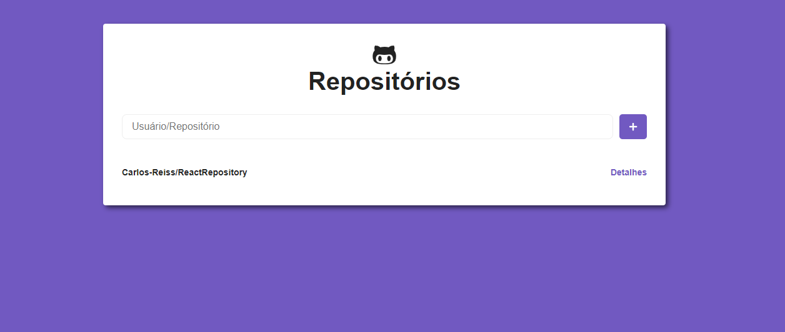

# React Repositorios do GitHub
## Desafio 05
Refinar uma aplicação de busca no repositorio do github utilizando ReactJS.

## Technology Used

[ReactJS](https://reactjs.org/)

[React-Icons](https://react-icons.netlify.com/#/)

[Styled-Components](https://styled-components.com/)

[Eslint](https://eslint.org/)

[Prettier](https://prettier.io/)

[axios](https://github.com/axios/axios)

## How to use
```bash
    # Clone this repository
    `$ git clone https://github.com/Carlos-Reiss/ReactRepository.git`

    # Go into the repository
    $ cd ReactRepository

    # Install dependencies
    $ yarn install

    # Running brownser
    $ yarn start

```
## Image previues

